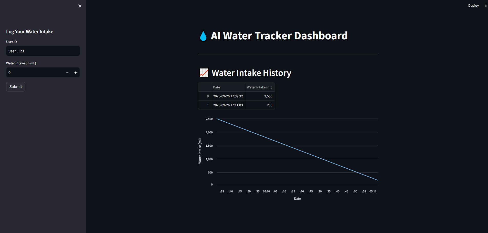

# AI Water Tracker 💧

AI Water Tracker is a hydration tracking application that leverages AI to provide personalized feedback on your daily water intake. It includes a Streamlit-based dashboard for user interaction and a FastAPI backend for API-based operations.

---

## Features 🚀

- **Track Water Intake**: Log your daily water consumption.
- **AI Feedback**: Get personalized hydration analysis using AI.
- **History Visualization**: View and analyze your water intake history with charts.
- **API Support**: Use RESTful APIs to log and retrieve water intake data.
- **Database Integration**: Stores data in a SQLite database.
- **Logging**: Logs user actions and errors for debugging.

---

## Project Structure 📂
```
├── .env # Environment variables 
├── app.log # Log file 
├── dashboard.py # Streamlit-based UI 
├── requirements.txt # Python dependencies 
├── water_tracker.db # SQLite database 
├── src/ 
│ ├── agent.py # AI agent for hydration analysis 
│ ├── api.py # FastAPI backend 
│ ├── database.py # Database operations 
│ ├── logger.py # Logging utility 
│ └── pycache/ # Compiled Python files
```
---

## Installation 🛠️

1. **Clone the Repository**:
   ```bash
   git clone https://github.com/your-username/ai-water-tracker.git
   cd ai-water-tracker

2. **Set Up Environment Variables**: Create a .env file in the root directory with the following content:
    ```bash
    EURI_API_KEY="your-euri-api-key" 
    DATABASE_URL=sqlite:///water_tracker.db


3. **Install Dependencies**:
    Use `pip` to install the required Python packages:
    ```bash
    pip install -r requirements.txt

4. **Initialize the Database**: Run the following command to create the necessary database tables:
    ```bash
    python -c "from src.database import create_tables; create_tables()"

---

## Usage 🖥️
1. **Streamlit Dashboard:**
    Start the Streamlit dashboard to log and visualize water intake:
    ```bash
    streamlit run dashboard.py

Open your browser and navigate to http://localhost:8501.

2. **FastAPI Backend:**
    Start the FastAPI backend for API operations:
    ```bash
    uvicorn src.api:app --reload

Open your browser and navigate to http://127.0.0.1:8000/docs to explore the API documentation.

---

## API Endpoints 🌐
- Log Water Intake:

    - POST /log-intake/
    - Request Body:
        ```bash
        {
        "user_id": "user_123",
        "intake_ml": 500
        }

- Get Water Intake History:
    - GET /history/{user_id}

---

## Dependencies 📦
See requirements.txt for the full list of dependencies.

---
## License 📜
This project is licensed under the MIT License. See the LICENSE file for details.

---
## Acknowledgments 🙌
- Streamlit for the interactive dashboard.
- FastAPI for the backend framework.
- SQLite for the database.
- EURI API for AI-powered hydration analysis.

---
## Author ✍️
Developed by Sourabh Rasal. Feel free to reach out for collaboration or feedback!